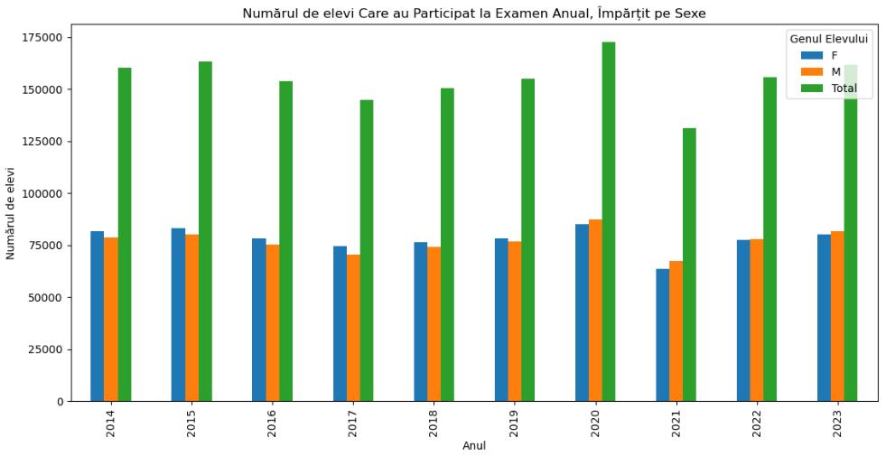
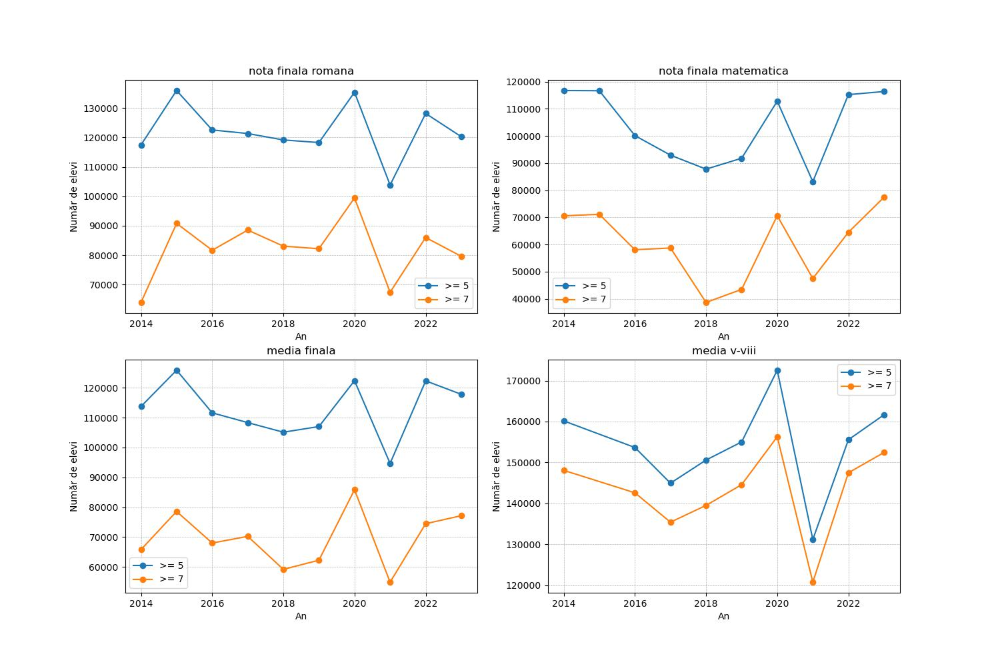
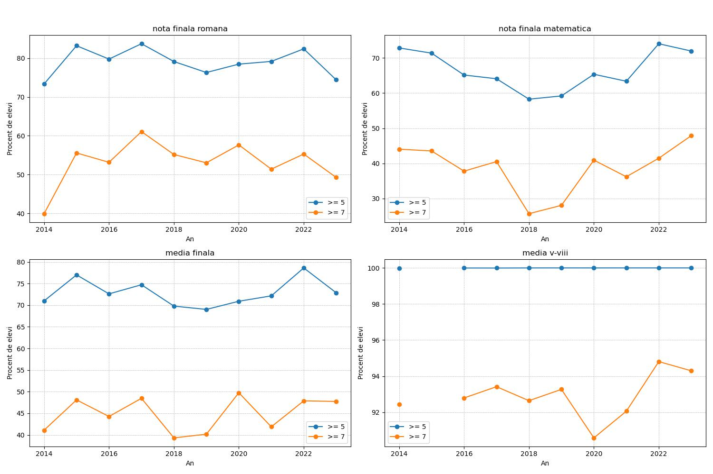
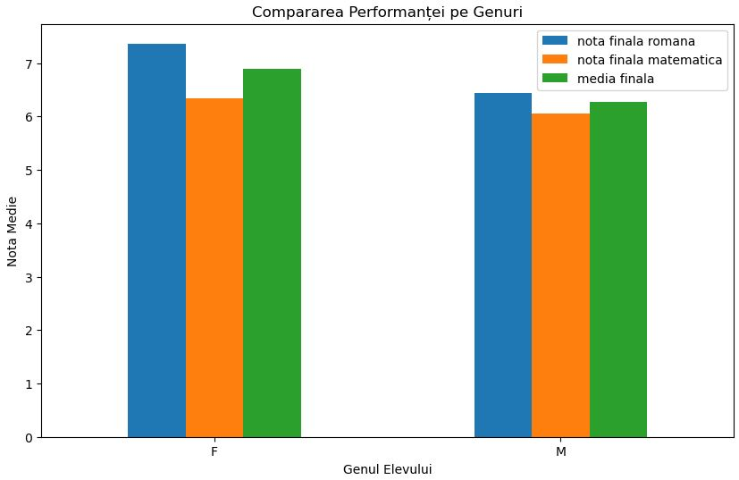
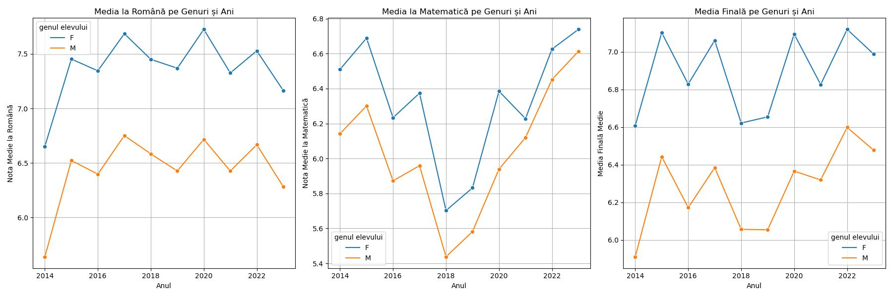
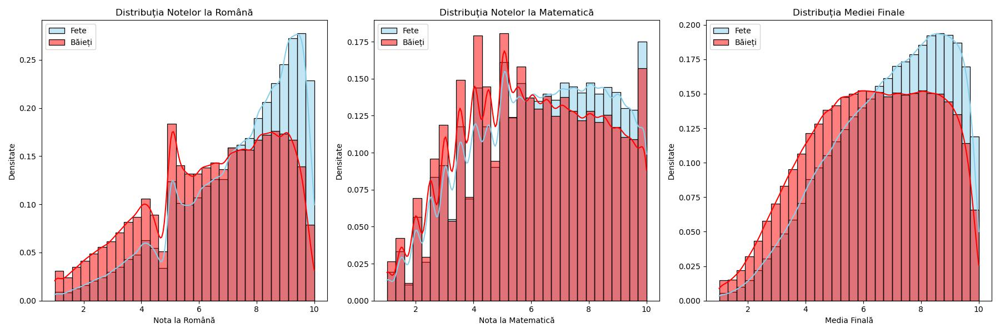
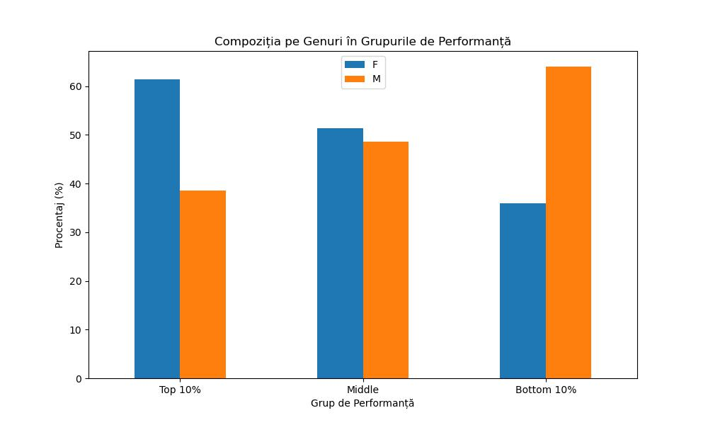
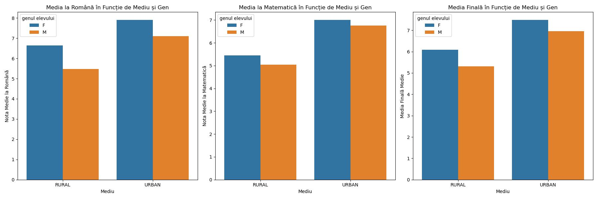

# Analiza rezultatelor la Evaluarea Națională între 2014 - 2023
Analiza făcută pe rezultatele individuale la Evaluarea Națională din România (examen la sfârșitul clasei a VIII-a), pentru anii 2014 - 2023.

## Numărul de elevi participanți anual

:exclamation: Observație: 
Deși se observa fluctuații în numărul de participanți de-a lungul anilor, se remarcă o stabilitate generală în cifrele înregistrate.

| An | F | M | Total |
|---------------------------------------|-------------------------------------------------------------------------|---------------------------------------------------------------------------------------------|------------------------------------------------------------------------------------------------------------------------------------------------------|
| 2014 | 81713 | 78475 | 160188 |
| 2015 | 83301 | 80117 | 163418 |
| 2016 | 78442 | 75231 | 153673 |
| 2017 | 74464 | 70491 | 144955 |
| 2018 | 76366 | 74237 | 150603 |
| 2019 | 78226 | 76794 | 155020 |
| 2020 | 85167 | 87376 | 172543 |
| 2021 | 63719 | 67461 | 131180 |
| 2022 | 77598 | 77963 | 155561 |
| 2023 | 80165 | 81487 | 161652 |

## Evoluția numărului de elevi cu note >= 5 și >= 7

## Evoluția procentului de elevi cu note >= 5 și >= 7

## Compararea performanței pe genuri

## Analiza Anuală
Comparăm performanța pe genuri pentru fiecare an în parte.

## Analiza distribuției notelor

Distribuția notelor pentru fiecare gen, folosind histograma. Astfel, putem vedea dacă există diferențe în variabilitatea scorurilor între fete și băieți.

- **Histograma pentru Română**: Compară distribuția notelor la limba română pentru fete (în albastru deschis) și băieți (în roșu). Acest grafic arată cum sunt distribuite notele și densitatea lor.
- **Histograma pentru Matematică**: Compară distribuția notelor la matematică pentru fete și băieți. Acesta oferă o vedere asupra modului în care scorurile se răspândesc și a diferențelor între genuri.
- **Histograma pentru Media Finală**: Ilustrează distribuția mediei finale pentru fete și băieți, oferind o perspectivă asupra variației generale în performanța academică.

> **Notă**: Aceste grafice ne permit să vedem nu doar mediile, ci și modul în care notele sunt răspândite între elevi de genuri diferite. Diferențele în formă, lățime și vârfuri ale distribuțiilor ne pot oferi informații despre variabilitatea și consistența performanței între genuri.

## Analiza grupurilor de performanță
Segmentăm elevii în grupuri bazate pe performanță (cele mai bune note 10%, mediu, cele mai slabe note 10%) și analizăm compoziția pe genuri în aceste grupuri.

## Compararea performanței în funcție de mediu urban/rural și gen 
Analizăm diferențele de performanță între fete și băieți din mediul urban față de cel rural.

