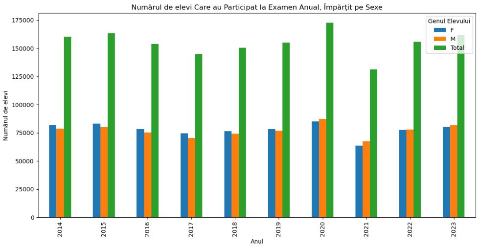

# Analiza rezultatelor la Evaluarea Nationala intre 2014 - 2023
Analiza facuta pe rezultatele individuale la Evaluarea Nationala din Romania (examen la sfarsitul clasei VIII), pentru anii 2014 - 2023.

## Numarul de elevi participanti anual
| An | F | M | Total |
|---------------------------------------|-------------------------------------------------------------------------|---------------------------------------------------------------------------------------------|------------------------------------------------------------------------------------------------------------------------------------------------------|
| 2014 | 81713 | 78475 | 160188
| 2015 | 83301 | 80117 | 163418
| 2016 | 78442 | 75231 | 153673
| 2017 | 74464 | 70491 | 144955
| 2018 | 76366 | 74237 | 150603
| 2019 | 78226 | 76794 | 155020
| 2020 | 85167 | 87376 | 172543
| 2021 | 63719 | 67461 | 131180
| 2022 | 77598 | 77963 | 155561
| 2023 | 80165 | 81487 | 161652

